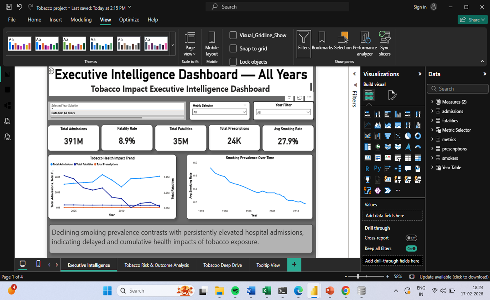
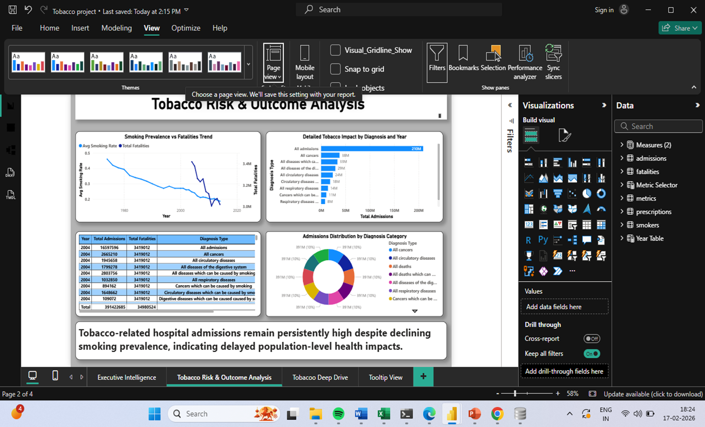

🚬 Tobacco Use and Mortality Analysis (2004–2015)

✦ Project Description 

Analyzed global tobacco consumption data and mortality statistics from 2004 to 2015 to identify patterns and potential correlations between tobacco use and health outcomes. The project aimed to understand long-term trends and generate insights related to public health.

Tobacco Risk & Outcome Analysis

✦ Key Responsibilities

• Collected and analyzed tobacco usage datasets

• Cleaned and structured data for accurate analysis

• Analyzed trends in tobacco consumption across different regions

• Studied mortality patterns associated with tobacco usage

• Created visualizations to represent trends and comparisons

✦ Key Insights

• Identified increasing and decreasing trends in tobacco consumption

• Highlighted regions with higher tobacco usage rates

• Observed correlations between tobacco use and mortality rates

✦ Tools & Technologies Used Python

• Pandas

• Excel

• Data Analysis

• Data Visualizaion

